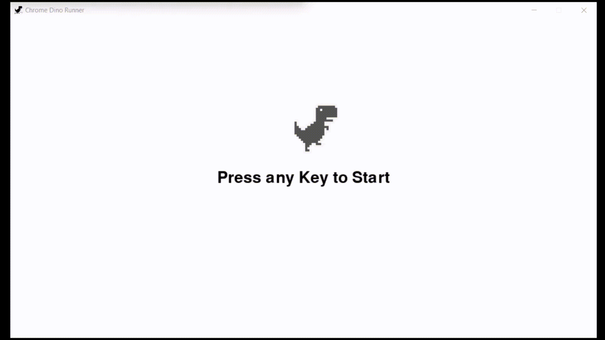

# 🦖 Dino-AI-NEAT 🧠


## Table of Contents
1. [Overview](#overview)
2. [Features](#features)
3. [Motivation](#motivation)
4. [Project Description](#project-description)
5. [Installation](#installation)
6. [Usage](#usage)
7. [Screenshots](#screenshots)
8. [Contributing](#contributing)
9. [Credits](#credits)
10. [License](#license)
11. [Contact](#contact)
12. [Learn More](#learn-more)

## Overview 📖

Welcome to the Dino-AI-NEAT project! This project integrates the classic Chrome Dino game with NEAT (NeuroEvolution of Augmenting Topologies) AI using Python and Pygame. Witness the AI evolve and master the game, surpassing human capabilities in dodging obstacles.

- **AI Framework**: NEAT-Python
- **Game Engine**: Pygame
- **Language**: Python

## Features 🌟

- **Dynamic AI Training**: Utilizes the NEAT algorithm to train neural networks.
- **Real-Time Visualization**: Observe the AI's learning process and evolution live.
- **User-Friendly Graphics**: Engaging and smooth game graphics.
- **Customizable Settings**: Easily modify NEAT and game parameters for personalized experiments.

## Motivation 💡

### What was my motivation?
I was inspired by the classic Chrome Dino game and wanted to explore the capabilities of NEAT AI fun and engagingly.

### Why did I build this project?
This project was built to showcase the potential of AI in learning and mastering simple games, providing a visual and interactive way to understand AI evolution.

### What problem does it solve?
The project demonstrates how AI can learn and adapt to new challenges, which is fundamental in various real-world applications.

### What did I learn?
Throughout this project, I learned about integrating game development with AI, the intricacies of the NEAT algorithm, and how to visualize AI training processes.

### What makes my project stand out?
Combining a beloved classic game with advanced AI techniques, real-time visualizations, and a customizable setup makes this project unique and educational.

## Project Description 📝

This project integrates the Chrome Dino game with NEAT AI to evolve and train a neural network to play the game. The AI starts with random neural networks and evolves over generations. Each generation's performance is evaluated based on the distance traveled by the dino. The best-performing networks are selected to produce offspring for the next generation, gradually improving their ability to navigate the game.

## File Structure 📂

```
Dino-AI-NEAT/
├───models
└───src
    ├───assets
    │   ├───Bird
    │   ├───Cactus
    │   ├───Dino
    │   └───Other
    └───classes
```

## Installation 🛠️

1. **Clone the Repository**:
    ```bash
    git clone https://github.com/Techiral/Dino-AI-NEAT.git
    cd Dino-AI-NEAT
    ```

2. **Install Dependencies**:
    ```bash
    pip install -r requirements.txt
    ```

3. **Run the Game**:
    ```bash
    python src/main.py
    ```

## Usage 🎮

### Playing Against AI
To play against the pre-trained AI, run these commands:
```bash
cd src
python game.py -d Normal
```
You can replace the `-d` tag (difficulty) with the difficulty level you would like to play against. Available difficulties are `Normal`, `Hard`, and `Impossible`. Each difficulty is trained by setting a fitness threshold of 147, 233, and 370, respectively.

### Training Your Dinosaur 🦖
To train a dinosaur, first edit the `fitness_threshold` inside `config.txt` in the `src` folder to whatever fitness threshold you want to train to. Note that you will have to wait until this threshold is met and the program closes itself before being able to save this dinosaur to be used later. On closing, the program will save the dinosaur to the `models` folder as `dino_f{fitness_score}.pkl`.

After setting your `fitness_threshold`, run:
```bash
cd src
python agent.py
```
The game itself is in `train.py`, but the training starts from `agent.py` which handles the initialization of NEAT, as well as saving the "winner".

## Screenshots 📸

### Initial State


### AI in Action


## Contributing 🤝

We welcome contributions from the community! Here's how you can get involved:

1. **Fork the Project**: Click the `Fork` button at the top-right of this page.
2. **Create Your Feature Branch**: 
    ```bash
    git checkout -b feature/AmazingFeature
    ```
3. **Commit Your Changes**: 
    ```bash
    git commit -m 'Add some AmazingFeature'
    ```
4. **Push to the Branch**: 
    ```bash
    git push origin feature/AmazingFeature
    ```
5. **Open a Pull Request**: Navigate to your forked repository on GitHub and click the `New Pull Request` button.

## Credits 🙌

- **Techiral**: [GitHub](https://github.com/Techiral)
- **Tutorials and References**: [NEAT-Python Documentation](https://neat-python.readthedocs.io/en/latest/)

## License 📄

This project is licensed under the **MIT License**. You are free to:

- **Use**: Use the code in any project.
- **Modify**: Make changes to the code.
- **Distribute**: Share the code with others.
- **Commercial Use**: Use the code in a commercial project.

Under the following terms:

- **Attribution**: You must give appropriate credit, provide a link to the license, and indicate if changes were made. You may do so in any reasonable manner, but not in any way that suggests the licensor endorses you or your use.

For more details, see the [LICENSE](./LICENSE) file.


## Contact 📬

Feel free to reach out for collaboration or questions!

- **YouTube**: [Techiral](https://youtube.com/Techiral)
- **Twitter**: [@Techiral](https://twitter.com/Techiral)
- **GitHub**: [Techiral](https://github.com/Techiral)

## Learn More 📚

- **Watch the Full Tutorial**: [AI Learns How To Play The Chrome Dinosaur Game](https://youtu.be/aNjsatpVXqw)
- **Read the Blog Post**: [Medium Article](https://medium.com/@gregoryg323/neural-networks-play-chromes-dino-game-with-neat-python-defe7c46a7f8)
